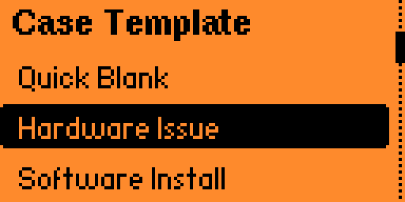
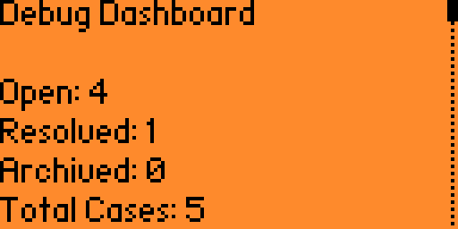
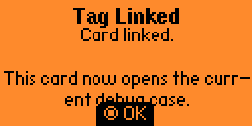

# Debug Mode

Debug Mode is a pocket troubleshooting notebook for Flipper Zero. It turns a messy problem into a small case file with symptoms, tests, results, next steps, notes, and a final resolution.

## Features

- Create structured debugging cases.
- Start from guided templates for hardware, software, network, Flipper, and app bugs.
- Keep the main flow simple: Start Debugging, Cases, Scan NFC Tag, Dashboard, and About.
- Set case priority and sort case lists by update time, priority, category, or title.
- Add timeline entries for symptoms, tests, results, next steps, notes, and resolutions.
- Browse timeline entries with compact type markers.
- Quick Log into the most recent open case.
- Mark cases resolved with confirmation, root cause, and lesson learned.
- Archive or delete cases after confirmation.
- Review dashboard totals across open, resolved, and archived cases.
- Link PicoPass/iCLASS cards to cases by card serial.
- Scan a linked PicoPass/iCLASS card to jump directly to its case.
- Export readable text files to /ext/apps_data/debug_mode/exports/.
- Export Markdown case reports from the same timeline.
- Review a Case Health scorecard with entry counts, test outcomes, next steps, root causes, and lessons.
- Browse open and resolved cases separately.
- Splash screen with a custom Debug Mode mark.

## Why It Exists

Debug notes are easy to lose while testing hardware, software, and device workflows. Debug Mode keeps the current problem, tests, results, and resolution on the Flipper so the trail stays with the work.

## Storage

Cases are stored on the Flipper SD card under:

/ext/apps_data/debug_mode/cases/

Exports are written under:

/ext/apps_data/debug_mode/exports/

Export Case writes a plain text report. Export Case Study writes a Markdown case study with sections for the problem, debug scorecard, tests, root cause, results, next steps, resolution, notes, lessons, and full timeline.

## NFC Cards

Debug Mode can link a PicoPass/iCLASS card serial to a case. Open a case, choose Link NFC Tag, and hold the card near the back of the Flipper. Later, choose Scan NFC Tag from the main menu and scan the same card to open the linked case.

The scanner currently supports PicoPass/iCLASS card linking.

This does not write data to the card. It stores the card serial and case id in:

/ext/apps_data/debug_mode/nfc_links.txt

This keeps the feature read-only on the card itself.

## Screenshots

Catalog screenshots are captured with qFlipper and kept at their original size and format.

## Navigation

Main menu:

- Start Debugging: create a blank or templated case.
- Cases: choose Open, Resolved, or Archived, then sort/browse.
- Scan NFC Tag: open a linked case from a physical tag.
- Dashboard: review overall troubleshooting stats.
- About: app notes and storage location.

Case view:

- Add Entry
- Timeline
- Case Health
- Resolve
- More...

More... contains NFC linking, exports, archive, and delete.

Timeline markers:

- ! Symptom
- ? Test
- = Result
- Greater-than marker: Next Step
- OK Resolution
- RC Root Cause
- L Lesson

## Build

From the app folder:

ufbt

## Install And Launch

Close qFlipper before launching from uFBT, because qFlipper can hold the serial port open.

ufbt launch

## Catalog Notes

For Flipper Apps Catalog submission, capture screenshots using qFlipper and do not resize or reformat them.
